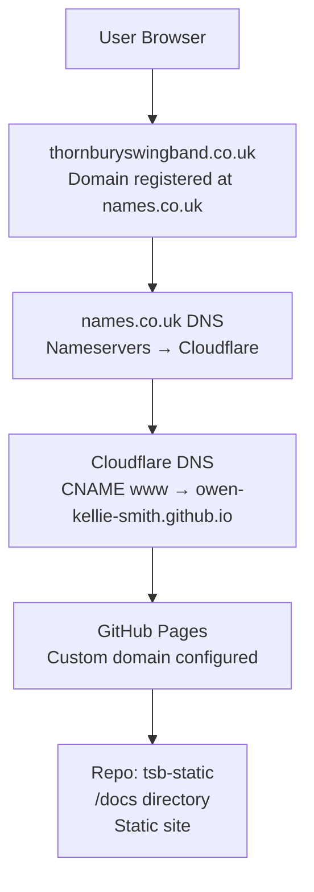

# Thornbury Swing Band – Static Site

Plain static HTML site served via GitHub Pages using Jekyll.

https://owen-kellie-smith.github.io/tsb-static/

aka

https://thornburyswingband.co.uk/  [How?](#dns-info)

**Similar repos** https://owen-kellie-smith.github.io/static-websites


---

## ✏️ Stuff that goes out of date (worth editing first)

1. [Upcoming events](#upcoming-events)
2. [Past events](#past-events)
3. [Band members](#band-members) and [Vacancies](#vacancies)
4. [Repertoire](#current-repertoire)
5. [Sound Engineer fees](#sound-engineer-fees)
6. [Practice venue](#practice-venue)
   
You can edit any page directly on GitHub — no software needed.

**How to edit a file (if you are the repo owner):**
1. Click the link below for the section you want to change
2. Click the **pencil icon** (✏️) in the top-right of the file view
3. Make your changes
4. Click **Commit changes**

The site updates automatically within a minute or two.

**How to change something (if you are not the repo owner):**
1. Raise an [issue](https://github.com/owen-kellie-smith/tsb-static/issues) i.e. describe what you want, or
2. Fork the repo (make a copy that you control)
3. Edit the fork.
4. Render the fork by running (in your repo root directory)

`jekyll serve`

and then browsing to

`http://localhost:4000`

5. Create a pull request (that your changes be incorporated into the main site).

---

### Upcoming events

**File:** [`events-future`](../../edit/main/events-future.md)

---

### Past events

**File:** [`events-past`](../../edit/main/events-past.md)

---

### Band members

**File:** [`the-band.md`](../../edit/main/the-band.md)

### Vacancies

**File:** [`the-band.md`](../../edit/main/the-band.md)

---

### Current repertoire

**File:** [`assets/thornbury-swing-band-current-repertoire.pdf`](../../blob/main/assets/thornbury-swing-band-current-repertoire.pdf)

**Referred to by:** [`your-event.md`](../../blob/main/your-event.md)

---

### Sound engineer fees

**File:** [`your-event.md`](../../edit/main/your-event.md)

---

### Practice venue

**File:** [`the-band.md`](../../edit/main/the-band.md)

---

## 🗂️ File structure

```
*.md                    – Page content
assets/                 – photos and PDFs
  style.css             – Shared styles
_layout			- Header and footer
```

---

## 🚀 GitHub Pages setup (first time only)

1. Push this folder to a GitHub repository
2. Go to **Settings → Pages**
3. Set source to **main branch / root folder**
4. Site goes live at `https://<username>.github.io/<repo>/` ie in this case at `https://owen-kellie-smith.github.io/tsb-static/`

**Notes:**
- Contact form uses a `mailto:` link (the WordPress form doesn't work in static sites)
- Media page has placeholder text — add SoundCloud/YouTube embed links when available

## DNS info

## Domain name management (info)
[thornburyswingband.co.uk is registered (at names.co.uk), (for free) for a year until March 2027. names.co.uk DNS settings forward to Cloudflare.](https://www.whois.com/whois/thornburyswingband.co.uk) Cloudflare has a CNAME for thornburyswingband.co.uk which is owen-kellie-smith.github.io.  Github fowards to etcb-website/docs via this repo > Settings > Pages (Custom Domain) which created [a CNAME in root](CNAME).


